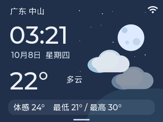
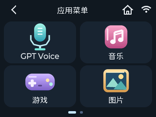
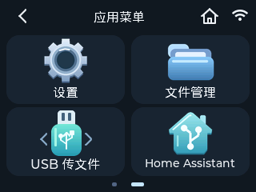
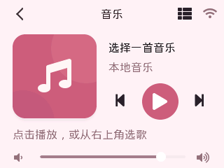
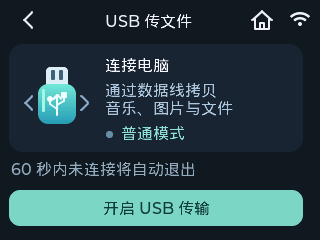

<h1 align="center">GPT Voice</h1>
<p align="center"><strong>一块 ESP32-S3，语音、音乐、天气与小游戏。</strong></p>
<p align="center">立创实战派桌面终端 · 320 × 240 触摸屏 · 实时语音交互</p>

<p align="center">
  <a href="https://github.com/295329161/GPT-Voice/releases/latest"></a>
  
  
  
</p>

<p align="center">
  <a href="https://github.com/295329161/GPT-Voice/releases/latest"><strong>下载最新版本</strong></a> ·
  <a href="#快速开始">快速开始</a> ·
  <a href="#实机界面">实机截图</a> ·
  <a href="docs/RELEASE.md">更新记录</a>
</p>

## 实机界面

以下为 **v1.1.2 设备实际帧缓冲截图**，原始分辨率 320 × 240。主界面显示拍摄时的时间与天气，音乐页为待选曲状态。

<p align="center"><strong>主界面 · 应用菜单（一）</strong></p>
<p align="center">
  
  &nbsp;
  
</p>

<p align="center"><strong>应用菜单（二） · 音乐播放器</strong></p>
<p align="center">
  
  &nbsp;
  
</p>

<p align="center"><strong>羊了个羊 · USB 传文件</strong></p>
<p align="center">
  
  &nbsp;
  
</p>

## 可以做什么

- **实时语音**：接入阶跃星辰语音服务，支持简短对话、时间查询、新闻检索和来源查看。
- **桌面看板**：联网校时与天气更新，支持昼夜及晴、云、雨、雪效果。
- **随身媒体库**：从 SD 卡播放音乐、浏览图片、管理文件；通过 USB 数据线与电脑传文件。
- **休闲与控制**：体感射击、层叠三消、Color Flood，以及亮度、音量、Wi-Fi 和 BLE 设置。

> Home Assistant 目前为“开发中”预留入口，尚不提供设备控制。BLE 支持扫描与基础连接，不支持经典蓝牙音箱。

## v1.1.2 更新

返回与主页采用**无底色细线图标**，按页面明暗适配颜色，并保留 **54 × 40** 的返回点击区域。音乐页恢复浅色导航；菜单、设置、游戏、文件和 USB 统一卡片与控件样式。亮度与音量页突出百分比，天气背景消除色带。

[完整更新记录](docs/RELEASE.md) · [本轮验证与边界](docs/VALIDATION_1_1_2.md)

## 快速开始

1. **准备硬件**：立创实战派 ESP32-S3 V1.0.1，16 MB Flash / 8 MB PSRAM，以及支持数据传输的 USB 线。音乐、图片和 USB 文件传输需要 SD 卡。
2. **下载并烧录**：前往 [Releases](https://github.com/295329161/GPT-Voice/releases)，下载同一版本的 `firmware.bin`、`bootloader.bin`、`partitions.bin`，按照[烧录说明](docs/FLASHING.md)操作。相同分区布局升级保留配置，**不要执行 `erase_flash`**。
3. **连接与配置**：在设备“设置”中连接 Wi-Fi；需要语音时，按下方步骤在本地网页填写服务配置。音乐与图片分别放入 SD 卡的 `/Music`、`/Pictures` 目录。

**版本下载**：[v1.1.2 · 当前版本](https://github.com/295329161/GPT-Voice/releases/tag/v1.1.2) · [v1.1.1 · 图标优化](https://github.com/295329161/GPT-Voice/releases/tag/v1.1.1) · [v1.1.0 · USB 传文件](https://github.com/295329161/GPT-Voice/releases/tag/v1.1.0) · [v1.0.0 · 首个完整版本](https://github.com/295329161/GPT-Voice/releases/tag/v1.0.0)

每个 Release 仅上传对应的三个固件 BIN，SHA-256 写在版本说明中；所有历史标签与源码记录保留。

<details>
<summary><strong>展开完整功能说明与操作细节</strong></summary>

- 开机显示真实时间与天气，左右滑动进入应用菜单。每页四个图标，第一页为 GPT Voice、音乐、游戏、图片，第二页为设置、文件管理、USB 传文件及 Home Assistant 预留入口。左箭头逐级返回，主页按钮回到看板。
- USB 传文件使用标准 U 盘协议访问 SD 卡。开启前确认停止音乐和语音，本机暂停 SD 文件访问；60 秒未连接电脑自动返回，已连接时在电脑安全弹出后恢复普通模式。详情见 [USB 使用说明](docs/USB_TRANSFER.md)。
- BOOT 单击关闭或打开背光，长按只切换一次。开机默认亮屏，恢复使用保存的亮度。熄屏期间音乐、语音和网络继续运行；复位键保持复位功能。
- 设置中连接 Wi-Fi、调整亮度/音量/体感灵敏度、设置天气城市、开启网页配置。配置保存到 NVS。当前 Wi-Fi 的密码输入框留空可使用已保存密码重新连接。
- 联网后 SNTP 校准北京时间，之后每 24 小时同步；Open-Meteo 天气每 15 分钟刷新，断网保留本次开机已有缓存。天气效果预览可切换晴、云、雨、雪及昼夜，预览数据不写入真实天气。
- 音乐读取 SD 卡 `/Music`，没有可用曲目时搜索根目录及子目录。支持 MP3 和 8–48 kHz、PCM16、单/双声道 WAV。音乐可在后台播放；进入语音页自动暂停，退出后点击播放继续。播放器提供前后曲、音量及已播放时间，不含拖动定位。
- 图片浏览从 `/Pictures` 开始，没有该目录则使用 SD 根目录；支持基线 JPEG/PNG（含大写扩展名和 `.jpeg`），文件最大 1 MiB、单边最多 2047 像素、像素总数最多 1,048,576。文件管理支持挂载、卸载、浏览、新建文件夹、重命名和确认删除。长按文件夹进入操作页；删除仅支持文件或空文件夹，正在播放/暂停占用的文件不能修改。
- 游戏包含雷电突击、层叠三消和 Color Flood。雷电使用姿态控制、自动射击、武器与生命掉落，开始/恢复时校准；三消有七格暂存槽、一次撤回及两次洗牌；Color Flood 限 25 步。
- BLE 提供扫描、连接和免输入安全配对。暂不支持密码/数字确认配对、经典蓝牙音箱或具体 GATT 业务。Home Assistant 页面明确标注“开发中”，不包含设备控制。


</details>

## 语音配置

1. 在“设置 → 网页与语音配置”开启网页，同一局域网浏览器访问屏幕显示的地址。
2. 输入设备屏幕配对码与 StepFun API Key。密钥留空保留原值，网页不会读取或回显保存的密钥。
3. 使用 Step Plan 时，地址填 `wss://api.stepfun.com/step_plan/v1/realtime`，模型填 `stepaudio-2.5-realtime`，音色可用 `linjiajiejie`。地址不包含 `?model=` 参数。默认普通 API 配置为 `wss://api.stepfun.ai/v1/realtime`、`stepaudio-3-realtime-preview`。
4. Step Plan 新闻/资料查询走官方 StepSearch MCP，沿用已有阶跃密钥。Tavily 是单独提供 Key 后启用的备用工具。第三方 API 使用按供应商规则计费。
5. 默认要求两三句、60 个汉字以内；新闻先概括两条重点，用户追问后再展开。网址放在“来源”页，语音不朗读来源清单。此长度是模型指令，不截断音频句子。无可核验结果时明确说明，日期与星期的明确问句直接读取校准时钟。

配置网页 10 分钟后关闭，提交必须携带配对码。只在可信局域网开启。个人设备固件未启用 Flash 加密、安全启动或 OTA；发布固件不包含 NVS 与任何密钥。实际联网能力依赖账户、网络和供应商接口。

## 开发与烧录

```bash
bash dev.sh build
bash scripts/test_host.sh
bash dev.sh flash-usb
python3 scripts/device_console.py artifacts/device-session
```

依赖 PlatformIO 6.x（常见安装位置 `~/.platformio/penv`）、主机 C/C++ 编译器和 Python 3；截图脚本还需要 Pillow。`platformio.ini` 与 `dependencies.lock` 固定平台及组件版本。`PLATFORMIO_CORE_DIR` 可指定其他 PlatformIO 目录。

构建脚本处理项目路径中的空格，产物在 `.pio/build/szp_s3/`，临时日志在 `artifacts/`。`flash-usb` 优先使用原生 USB，缺失时回退独立 CH340；`flash` 直接使用 CH340。USB 传输仍开启时脚本拒绝复位烧录，请先安全弹出。串口路径在 `platformio.ini` 和脚本中可调整。串口工具支持 `status`、`ui`、`page N`、`tap X Y`、`swipe X Y X2 Y2`，`:shot name` 保存 PNG，`:quit` 退出且不复位设备。不要同时打开多个串口读者。

Releases 提供分区表、bootloader 与应用固件，版本说明附 SHA-256。相同分区布局升级不擦除 NVS，保留 Wi-Fi/API 配置；不要执行 `erase_flash`。该分区布局不适用于其他板型。

## 项目资料

- [版本说明](docs/RELEASE.md)、[1.0.0 基线验证](docs/VALIDATION.md)
- [1.1.2 界面风格与验证](docs/VALIDATION_1_1_2.md)、[1.1.1 图标优化记录](docs/VALIDATION_UI.md)
- [1.0.0 页面截图归档](validation/1.0.0/index.html)
- [USB 功能验证](docs/VALIDATION_USB.md)、[1.1.0 界面截图归档](validation/1.1.0/index.html)
- [架构与扩展](docs/ARCHITECTURE.md)、[语音维护要求](docs/VOICE_BASELINE.md)
- [硬件诊断与复测](docs/TESTING.md)

`src/` 是应用和板级驱动，`components/audio_player/` 是保留许可及本地修复记录的播放器组件，`tests/` 与 `scripts/` 用于构建和验证。字体、板级驱动及第三方组件许可随源码保留。历史演示、旧日志和私有整片 Flash 备份保存在项目目录之外的“项目归档”，不进入公开发布包。
